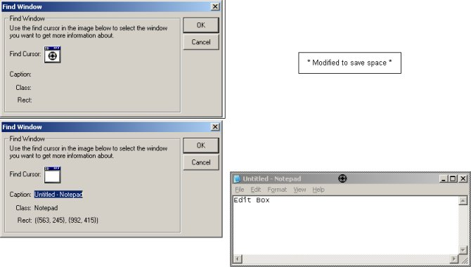



## Drag and drop FindWindow

### Description

This is more for a programmer's tool then anything else.

It allows you to select a window on screen with the mouse using a cursor and a smaller image representing that cursor on the dialog (which disappears when you click on it and drag it, reappearing when you make a selection)
 
### More Info
 
The project was fairly simple to construct, you can easily add it to a new project by adding the form to the project. It's light weight and should be easy to follow.

I made a small joke of the api comments, so if you'd like simply delete them.

Author of the code inside is Allen Copeland, which is my real name.

             |
---                |---
**Submitted On**   |2001-11-01 01:49:38
**By**             |[Linguar Amadala](https://github.com/Planet-Source-Code/PSCIndex/blob/master/ByAuthor/linguar-amadala.md)
**Level**          |Intermediate
**User Rating**    |5.0 (15 globes from 3 users)
**Compatibility**  |VB 6\.0
**Category**       |[Miscellaneous](https://github.com/Planet-Source-Code/PSCIndex/blob/master/ByCategory/miscellaneous__1-1.md)
**World**          |[Visual Basic](https://github.com/Planet-Source-Code/PSCIndex/blob/master/ByWorld/visual-basic.md)
**Archive File**   |[Drag and d326151112001\.zip](https://github.com/Planet-Source-Code/linguar-amadala-drag-and-drop-findwindow__1-28575/archive/master.zip)

